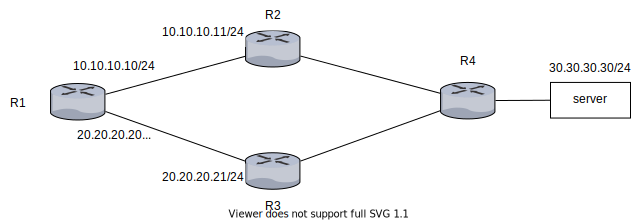
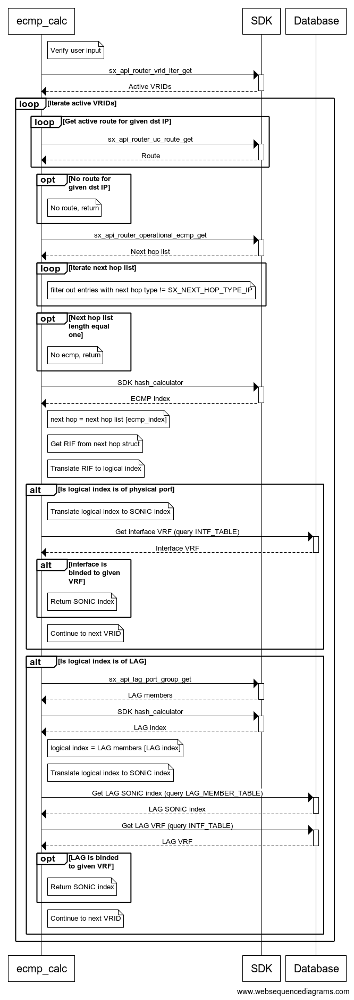
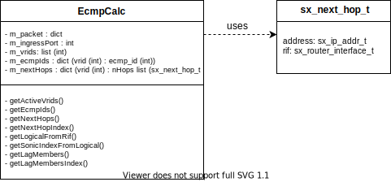
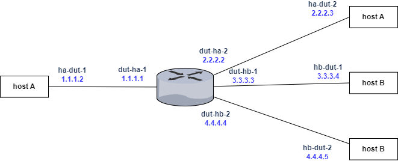
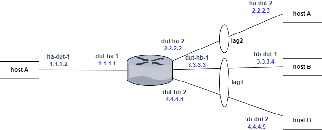

<!-- omit in toc -->
# SONiC ECMP calculator #

<!-- omit in toc -->
## Table of Content
- [Revision](#revision)
- [1 Feature overview](#1-feature-overview)
- [2 Requirements](#2-requirements)
    - [2.1 Functionality](#21-functionality)
    - [2.2 Usage notes](#22-usage-notes)
    - [2.3 Command interface](#23-command-interface)
        - [2.3.1 Packet JSON](#231-packet-JSON)
    - [2.4 Error handling](#24-error-handling)
- [3 Deign](#3-design)
	- [3.1 Main flow](#31-main-flow)
    - [3.2 Validate user input](#32-validate-user-input)
	- [3.3 Longest prefix match](#33-longest-prefix-match)
    - [3.4 Get logical from RIF](#34-get-logical-from-RIF)
        - [3.4.1 Handle LAG](#341-handle-lag)
    - [3.5 Get SONiC index from logical index ](#35-get-sonic-index-from-logical-index)  
	- [3.6 SDK hash calculator](#36-sdk-hash-calculator)
        - [3.6.1 Compilation](#361-compilation)
        - [3.6.2 Usage](#362-usage)
	- [3.7 ECMP calculator in SONiC tree](#37-ecmp-calculator-in-sonic-tree)
	- [3.8 Class diagram](#38-class-diagram)
	- [3.9 SDK API](#39-sdk-api)
    - [3.10 Test design](#310-test-design)
	    - [3.10.1 System tests](#3101-system-tests)
            - [3.10.1.1 Interface tests](#31011-interface-tests)
            - [3.10.1.2 LAG tests](#31012-lag-tests)

### Revision
| Rev | Date       | Author         | Description     |
|:---:|:----------:|:--------------:|:----------------|
| 0.1 | 09/2022    | Lior Avramov   | Initial version |

 ## List of figures

[Figure 1: ECMP example](#figure-1-ecmp-example)\
[Figure 2: ECMP calculator main flow](#figure-2-ecmp-calculator-main-flow)\
[Figure 3: ECMP calculator test setup](#figure-3-ecmp-calculator-test-setup)\
[Figure 4: ECMP calculator test setup lag](#figure-4-ecmp-calculator-test-setup-lag)


# 1 Feature overview
An equal cost multipath (ECMP) is formed when routing table contains multiple next hop addresses for the same destination IP address.\
ECMP will load balance the outbound traffic between the IP interfaces. \
The purpose of ECMP calculator is to calculate what will be the egress interface for a given packet.

```
R1@sonic:/# show ip route

C>* 10.10.10.0/24 is directly connected, Ethernet0, 00:00:10
C>* 20.20.20.0/24 is directly connected, Ethernet4, 00:00:10

S>* 30.30.30.0/24 [1/0] via 10.10.10.11, Ethernet0, weight 1, 00:00:09
  *                     via 20.20.20.21, Ethernet4, weight 1, 00:00:09
```

###### Figure 1: ECMP example


# 2 Requirements
## 2.1 Functionality
- ECMP calculator calculates egress interface for a provided packet.
    - If egress interface is a LAG, calculate the physical egress interface (LAG member).
- ECMP calculator is vendor specific tool, it calls directly to NVIDIA SDK API.
- ECMP calculator supports only routed packets.
    - IPv4/IPv6 TCP/UDP packets
    - IPinIP and VXLAN encapsulated packets
- Changes done in the packet claissification (ACL, PBR) are not taken into consideration during calculation.
- Ingress interface provided by user must be a physical interface.

## 2.2 Usage notes
- ECMP calculator performs its calculations based on the current operational state of the router. To calculate the egress port, it fetches routes from HW. Routes exist in HW only for next hops with a resolved ARP.

## 2.3 Command interface
- User shall enter syncd container to run ECMP calculator.
- User shall provide the following input parameters:
    - JSON file describing a packet
    - Ingress port (e.g. "Ethernet0")
    - Debug option for debug purposes (optional)
    - VRF name (optional)
- Numbers in packet JSON must be in base-ten.
- Usage example:
```
$ /usr/bin/ecmp_calculator/ecmp_calc.py --if Ethernet0 --packet ./packet.json --vrf Vrf_red
Egress port: Ethernet0
```
```
$ /usr/bin/ecmp_calc.py -h
usage: ecmp_calc.py [--help] [--if] [--packet] [--debug] [--vrf]

query hardware for egress interface

required arguments:
  -i, --if              ingress interface
  -p, --packet          packet description

optional arguments:
  -h, --help            show this help message and exit
  -v, --vrf             VRF name
  -d, --debug           run in debug mode

```
### 2.3.1 Packet JSON
The following table defines the structure of a packet JSON file.

| ecmp_hash |             |       |             |             |        |                                                                                  |
|-----------|-------------|-------|-------------|-------------|--------|----------------------------------------------------------------------------------|
|           | packet_info |       |             |             | object |                                                                                  |
|           |             | outer |             |             | object |                                                                                  |
|           |             |       | layer2      |             | object |                                                                                  |
|           |             |       |             | smac        | string |                                                                                  |
|           |             |       |             | dmac        | string |                                                                                  |
|           |             |       |             | ethertype   | number | 16bits, needed for IPv4 or IPv6 packet                                           |
|           |             |       |             | outer_vid   | number | 12bits                                                                           |
|           |             |       |             | outer_pcp   | number | 3bits                                                                            |
|           |             |       |             | outer_dei   | number | 1bits                                                                            |
|           |             |       |             | inner_vid   | number | QinQ                                                                             |
|           |             |       |             | inner_pcp   | number | QinQ                                                                             |
|           |             |       |             | inner_dei   | number | QinQ                                                                             |
|           |             |       | arp         |             |        | Needed for arp packet                                                            |
|           |             |       |             | spa         | string | source ip                                                                        |
|           |             |       |             | tpa         | string | target ip                                                                        |
|           |             |       | ipv4        |             | object |                                                                                  |
|           |             |       |             | sip         | string |                                                                                  |
|           |             |       |             | dip         | string |                                                                                  |
|           |             |       |             | proto       | number | 8bits                                                                            |
|           |             |       |             | dscp        | number | 6bits                                                                            |
|           |             |       |             | ecn         | number | 2bits                                                                            |
|           |             |       |             | mflag       | number | 1bit                                                                             |
|           |             |       |             | l3_length   | number | 16bits                                                                           |
|           |             |       | ipv6        |             | object | should not co-exist with ipv4 field                                              |
|           |             |       |             | sip         | string |                                                                                  |
|           |             |       |             | dip         | string |                                                                                  |
|           |             |       |             | mflag       | number | 1bit                                                                             |
|           |             |       |             | next_header | number | 8bits                                                                            |
|           |             |       |             | dscp        | number | 6bits                                                                            |
|           |             |       |             | ecn         | number | 2bits                                                                            |
|           |             |       |             | l3_length   | number | 16bits                                                                           |
|           |             |       |             | flow_label  | number | 20bits                                                                           |
|           |             |       | tcp_udp     |             | object |                                                                                  |
|           |             |       |             | sport       | number | 16bits                                                                           |
|           |             |       |             | dport       | number | 16bits                                                                           |
|           |             |       | vxlan_nvgre |             | object |                                                                                  |
|           |             |       |             | vni         | number | 24bits                                                                           |
|           |             | inner |             |             | object | overlay                                                                          |
|           |             |       | layer2      |             | object |                                                                                  |
|           |             |       |             | smac        | string |                                                                                  |
|           |             |       |             | dmac        | string |                                                                                  |
|           |             |       |             | ethertype   | number | 16bits                                                                           |
|           |             |       | ipv4        |             | object |                                                                                  |
|           |             |       |             | sip         | string |                                                                                  |
|           |             |       |             | dip         | string |                                                                                  |
|           |             |       |             | mflag       | number | 1bit                                                                             |
|           |             |       |             | proto       | number | 8bits                                                                            |
|           |             |       | ipv6        |             | object | should not co-exist with ipv4 field                                              |
|           |             |       |             | sip         | string |                                                                                  |
|           |             |       |             | dip         | string |                                                                                  |
|           |             |       |             | mflag       | number | 1bit                                                                             |
|           |             |       |             | next_header | number | 8bits                                                                            |
|           |             |       |             | flow_label  | number | 20bits                                                                           |
|           |             |       | tcp_udp     |             | object |                                                                                  |
|           |             |       |             | sport       | number | 16bits                                                                           |
|           |             |       |             | dport       | number | 16bits                                                                           |

Packet JSON file example:

```json
{
	"packet_info": {
		"outer": {
			"ipv4": {
				"sip": "200.200.200.200",
				"dip": "3.3.3.220"
			},					
			"layer2": {
				"smac": "aa:bb:22:22:ff:ff",
				"dmac": "aa:bb:22:22:ff:fe",
				"ethertype": 2048
			},					
			"tcp_udp": {
				"sport": 80,
				"dport": 8000
			}
		},
		"inner": {	
			"ipv6": {
				"sip": "2001:0db8:85a3:0000:0000:8a2e:0370:7337",
				"dip": "2000:0db8:85a3:0000:0000:8a2e:0370:7334",
				"next_header": 50
			},						
			"layer2": {
				"smac": "00:00:00:00:00:11",
				"dmac": "00:00:00:00:00:22",
				"ethertype": 2048
			},				
			"tcp_udp": {
				"sport": 20,
				"dport": 54
			}
		}			
	}
}
```

## 2.4 Error handling
ECMP calculator handles the following errors:
1. Packet JSON has invalid JSON format.
2. Field in packet JSON has invalid data type (must be a string or number as defined in [2.3.1 Packet JSON](#231-Packet-JSON)).
3. Packet JSON does not contain outer destination IP.
4. Packet JSON contains invalid MAC or IP.
5. Ingress interface is not a physical interface.


# 3 Design
## 3.1 Main flow
ECMP calculator perform the following:
1. Validate user input.
2. Call sx_api_router_vrid_iter_get to get all VRIDs in use.
3. Iterate VRIDs and calculate egress interface.
4. When interface is found in a specific VRID, query APP DB INTF_TABLE table for the interface VRF.
5. If interface is binded to given VRF, egress interface found.

Egress interface calculation steps:
1. Get the route with the longest prefix match for given destination IP.
2. Use ECMP id from route structure (route.route_data.uc_route_param.ecmp_id) to get next hop list (sx_api_router_operational_ecmp_get).
3. Filter out all next hops which are not from type SX_NEXT_HOP_TYPE_IP.
4. If size of next hop list is bigger than one, ECMP exists for given destination IP, call SDK hash calculator for ECMP.
5. SDK hash calculator returns ECMP index, use this index to get next hop from next hop list.
6. Next hop structure contains RIF id, translate it to SDK logical index.
7. If logical index is of a physical port, translate to SONiC index and if binded to given VRF, return it.
8. If logical index is of LAG, call SDK hash calculator for LAG.
9. SDK hash calculator returns LAG index, use this index to get LAG member from which traffic will egress.
10. Translate LAG member logical index to SONiC index and if LAG is binded to given VRF, return it.


###### Figure 2: ECMP calculator main flow

## 3.2 Validate user input
ECMP calculator perfroms the following validations:
1. Validate ingress interface is a physical interface.
2. Validate VRF provided by user exists.
3. Perform the following validations on packet JSON:
    1. Use json Python module (json.load) to verify it has valid JSON format.
    2. Use jsonschema Python module to verify all fields have valid data types (string or number as defined in [2.3.1 Packet JSON](#231-Packet-JSON)).
    3. Outer destination IP exist.
    4. All IPs and MAC addresses are valid.
    5. IPV6 and IPV4 fields do not co exist in packet JSON.
    6. If HW is configured to perform hash by a field that was not provided in packet JSON, perform the calculation with the field zeroed out.

## 3.3 Longest prefix match
There might be a case where there are several routes that match given destination IP. \
Consider the following route table:
```
S>* 3.3.0.0/16 [1/0] via 1.1.1.2, Ethernet236, weight 1, 00:08:59
S>* 3.3.3.0/24 [1/0] via 1.1.1.2, Ethernet236, weight 1, 00:22:40
  *                  via 2.2.2.3, Ethernet120, weight 1, 00:22:40
```
Both prefixes in the above table cover destination IP 3.3.3.250, however the prefix with the most matching bits is the prefix router will use.
ECMP calculator finds this prefix by calling to sx_api_router_uc_route_get in loop. 

ECMP calculator does not fetch the entire route table, instead it retrieves route information for each prefix that covers the destination IP from longest prefix (32 for IPv4, 128 for IPv6) to the shortest.

The first match is the LPM search result.\
LPM calculation average runtime measured is 35 msec for IPv4 and 85 msec for IPv6.

Pseudo code (IPv4):
```
mask = 0xffffffff
for idx in range(0, 32):
  prefix.ip = ip & mask
  prefix.mask = mask
  route = sx_api_router_uc_route_get(prefix)
  if (route)
    break
  mask <<= 1
```

Example
```
sx_api_router_uc_route_get(3.3.3.250/32)
sx_api_router_uc_route_get(3.3.3.250/31)
sx_api_router_uc_route_get(3.3.3.248/30)
sx_api_router_uc_route_get(3.3.3.248/29)
sx_api_router_uc_route_get(3.3.3.240/28)
sx_api_router_uc_route_get(3.3.3.224/27)
sx_api_router_uc_route_get(3.3.3.192/26)
sx_api_router_uc_route_get(3.3.3.128/25)
sx_api_router_uc_route_get(3.3.3.0/24)
exit
```

## 3.4 Get logical from RIF
Translation of next hop RIF id to logical index depends on the RIF type. \
ECMP calculator calls sx_api_router_interface_get to get RIF type.
* If type is router port (SX_L2_INTERFACE_TYPE_PORT_VLAN), egress interface logical index is if.ifc.port_vlan.port
* If type is VPORT (SX_L2_INTERFACE_TYPE_VPORT), call sx_api_port_vport_base_get (vport=if.ifc.vport.vport), egress interface logical index is being returned in log_port_p.
* If type is VLAN interface (SX_L2_INTERFACE_TYPE_VLAN), perform the following:
1. Call sx_api_router_neigh_get to get mac adresss of the next hop.
2. Call sx_api_fdb_uc_mac_addr_get to get FDB entry (mac=next hop mac vlan=if.ifc.vlan.vlan).
3. FDB entry contains the egress interface logical index (entry.log_port).

### 3.4.1 Handle LAG
In the case where egress interface is LAG (first four bits of logical index are 0001), ECMP calculator performs the following:
1. Call sx_api_lag_port_group_get to get LAG members.
2. Sort LAG members list in ascending order.
3. Call SDK hash calculator again for LAG.
4. SDK hash calculator returns LAG index, use this index to get LAG member logical index from LAG members list.
5. Translate LAG memeber logical index to SONiC index.
6. Query LAG_MEMBER_TABLE in application DB to get LAG SONiC index.
```
root@sonic:/# redis-cli -n 0 keys "*LAG_MEMBER_TABLE*" | grep Ethernet0
LAG_MEMBER_TABLE:PortChannel200:Ethernet0
```
7. Query INTF_TABLE in application DB to get LAG VRF
```
root@r-tigris-22:/# redis-cli -n 0 hget "INTF_TABLE:PortChannel200" vrf_name
"Vrf_lior"
```
8. If VRF is equal to the VRF provided by the user, egress interface found.

## 3.5 Get SONiC index from logical index 
ECMP calculator keeps a map of logical index to SONiC index.
Calculation of SONiC index based on the following formula:
```
SONiC index = (module id * num of lanes in module) + index of the first lane in use
```
Call sx_api_port_device_list_get to get spectrum type, since number of lanes in module depends on spectrum type. \
Call sx_api_port_device_get to get logical index, module id and bitmap of module lanes in use.

Example:
```
  Interface            Lanes    Speed    MTU    FEC    Alias    Vlan    Oper    Admin             Type    Asym PFC
-----------  ---------------  -------  -----  -----  -------  ------  ------  -------  ---------------  ----------
  Ethernet0          0,1,2,3      25G   9100    N/A     etp1  routed      up       up  QSFP28 or later         N/A
  Ethernet4          4,5,6,7     100G   9100    N/A     etp2  routed      up       up  QSFP28 or later         N/A
  Ethernet8        8,9,10,11     100G   9100    N/A     etp3  routed      up       up  QSFP28 or later         N/A
 Ethernet12            12,13      50G   9100    N/A    etp4a  routed      up       up  QSFP28 or later         N/A
 Ethernet14            14,15      50G   9100    N/A    etp4b  routed      up       up  QSFP28 or later         N/A
```
```
sonicIndex [0]  logical [65593] moduleId [0] laneBitMap[00001111] laneIndex [0]
sonicIndex [4]  logical [65595] moduleId [1] laneBitMap[00001111] laneIndex [0]
sonicIndex [8]  logical [65597] moduleId [2] laneBitMap[00001111] laneIndex [0]
sonicIndex [12] logical [65599] moduleId [3] laneBitMap[00000011] laneIndex [0]
sonicIndex [14] logical [65600] moduleId [3] laneBitMap[00001100] laneIndex [2]
```

## 3.6 SDK hash calculator
### 3.6.1 Compilation
Hash calculator is a binary supplied by SDK.\
Need to add a new debian to SDK compilation (e.g sx-hash-calc_1.mlnx.4.5.3130_amd64.deb).

The following Makefiles handle SDK debians:
1. sonic-buildimage/platform-mellanox/sdk.mk
2. sonic-buildimage/platform-mellanox/docker-syncd-mlnx.mk

### 3.6.2 Usage
Hash calculator path in syncd will be /usr/bin/hash_calculator.\
Hash calculator gets JSON as input and writes the output to another JSON.

Input JSON for ECMP call is the same as the JSON provided by user with addition of 2 fields, "ecmp_size" which is number of next hops and "ingress_port" which is logical index of the ingress port.

Input JSON for LAG call is the same as the JSON provided by user with addition of 2 fields, "lag_size" which is number of ports in LAG and "ingress_port" which is logical index of the ingress port.

Usage example:
```
/usr/bin/hash_calculator -c input.json -o output.json
```

Input JSON example for ECMP:
```json
{
    "ecmp_hash": {
        "ecmp_size": 5,
        "ingress_port": "0x1007d",
        "packet_info": {
            "outer": {
                "ipv4": {
                    "dip": "100.100.200.4",
                    "proto": 17,
                    "sip": "100.100.200.5"
                },
                "layer2": {
                    "ethertype": 2048,
                    "outer_vid": "5"
                },
                "tcp_udp": {
                    "dport": 7778,
                    "sport": 9877
                }
            }
        }
    }
}
```

Output JSON example for ECMP:
```json
{
	"ecmp_hash":	{
		"hash_value":	3940,
		"ecmp_index":	4
	}
}
```

Input JSON example for LAG:
```json
{
    "lag_hash": {
        "lag_size": 4,
        "ingress_port": "0x10000001",
        "packet_info": {
            "outer": {
                "ipv4": {
                    "dip": "100.100.200.4",
                    "proto": 17,
                    "sip": "100.100.200.5"
                },
                "layer2": {
                    "ethertype": 2048,
		    "outer_vid": "5"
                },
                "tcp_udp": {
                    "dport": 7778,
                    "sport": 9877
                }
            }
        }
    }
}
```
Output JSON example for LAG:
```json
{
	"lag_hash":	{
		"hash_value":	1006,
		"lag_index":	3,
        "lag_mc_index":	4
	}
}
```

## 3.7 ECMP calculator in SONiC tree
ECMP calculator path in SONiC tree will be sonic-buildimage/platform/mellanox/docker-syncd-mlnx/ecmp_calc.py. \
The tool will be copied to syncd container during container creation.\
Need to add copy operation in syncd dockerfile (platform/mellanox/docker-syncd-mlnx/Dockerfile.j2).\
ECMP calculator path in syncd container will be /usr/bin/ecmp_calc.py

## 3.8 Class diagram


## 3.9 SDK API

1. Get active VRIDs
```
sx_api_router_vrid_iter_get

[in] handle         - SX-API handle
[in] cmd            - GET/GET_NEXT/GET_FIRST
[in] vrid_key       - Virtual Router ID
[out] vrid_list_p   - Pointer to the list of valid VRIDs returned
[in,out] vrid_cnt_p - [in] number of entries to retrieve (max: 254)/[out] retrieved  number of entries
```

2. Get UC routes from routing table
```
sx_api_router_uc_route_get

[in] handle - SX-API handle
[in] cmd - GET/GET_FIRST/GETNEXT
[in] vrid - Virtual Router ID
[in] network_addr - IP network address
[in] filter_p - UC route key_filter
[out] uc_route_get_entries_list_p - Array of UC route entries found
[in,out] uc_route_get_entries_cnt_p - Number of UC route entries found

Relevant data:
route_entry.network_addr
route_entry.route_data.uc_route_param.ecmp_id
route_entry.route_data.type

```

3. Get operational next hops
```
sx_api_router_operational_ecmp_get

[in] handle             - SX-API handle
[in] ecmp_id            - ID of an ECMP container
[out] next_hop_list_p   - List of next hops
[out] next_hop_cnt_p    - Amount of next hops

Relevant data:
next_hop_cnt
next_hop_list_p.next_hop_key.next_hop_key_entry.ip_next_hop.rif
next_hop_list_p.next_hop_key.next_hop_key_entry.ip_next_hop.address

```

4. Get mac address of the next hop
```
sx_api_router_neigh_get

[in] handle - SX-API handle
[in] cmd - GET/GET_FIRST/GET_NEXT
[in] rif - Router Interface ID
[in] neigh_key_p - Neighbor key
[in] filter_p - Neighbor key_filter
[out] neigh_entry_list_p  - found neigh entries arr
[in,out] neigh_entry_cnt_p - found neigh entries num
```

5. Get LAG members
```
sx_api_lag_port_group_get

[in] handle                - SX-API handle
[in] swid                  - Switch (virtual partition) ID
[in] lag_log_port          - LAG's port group ID
[in,out] log_port_list_p   - List of logical ports
[in,out] log_port_cnt_p    - [in] number of logical ports in list/[out] number of logical ports in a LAG
```

6. Get router interface
```
sx_api_router_interface_get

[in] handle      - SX-API handle
[in] rif         - Router Interface ID
[out] vrid_p     - Virtual Router ID
[out] ifc_p      - Interface type and parameters
[out] ifc_attr_p - Interface attributes

Relevant data:
ifc_p.type
ifc_p.ifc.vport.vport
ifc_p.ifc.vlan.vlan

```

7. Get vport logical index
```
sx_api_port_vport_base_get

[in] handle        - SX-API handle
[in] vport         - VPort logical ID
[out] vlan_id_p    - VLAN
[out] log_port_p   - Base port logical ID
```

8. Get FDB entry
```
sx_api_fdb_uc_mac_addr_get

[in] handle         - SX-API handle
[in] swid           - Virtual switch partition ID
[in] cmd            - GET/GETNEXT/GET_FIRST
[in] mac_type       - static/dynamic/all
[in] key_p          - MAC entry with information for search (MAC+FID)
[in] key_filter_p   - Filter types used on the mac_list_p (FID/MAC/logical port)
[out] mac_list_p    - Pointer to list
[in,out] data_cnt_p - [in] Number of entries to retrieve/[out] retrieved number of entries
```

9. Get chip type
```
sx_api_port_device_list_get

[in] handle                - SX-API handle
[out] device_info_list_p   - List of device info entries
[in,out] device_info_cnt_p - [in]input/[out]output list length
```

10. Get ports information
```
sx_api_port_device_get

[in] handle                  - SX-API handle
[in] device_id               - Device ID
[in] swid                    - Switch ID (use SX_SWID_ID_DONTCARE to get all ports)
[out] port_attributes_list_p - port attributes list
[in,out] port_cnt_p          - [in] port attributes list length/[out] port attributes number
```
## 3.10 Test design

### 3.10.1 System tests
The following tests will be performed manually on a canonical setup.

#### 3.10.1.1 Interface tests

###### Figure 3: ECMP calculator test setup

1. Configure static routes:
	1. config route add prefix 50.50.50.0/24 nexthop 2.2.2.3
	2. config route add prefix 50.50.50.0/24 nexthop 3.3.3.4
	3. config route add prefix 50.50.50.0/24 nexthop 4.4.4.5
2. dut-ha-1 dut-ha-2 dut-hb-1 dut-hb-2 are configured as router ports.
3. Run ecmp_calc.py to detemine egress port for packet 1.
4. Send packet 1 from ha-dut-1 and verify egress port is as calculated.
5. Repeat stpes 3-4 with 5 incremented source ip addresses, verify egress port is changed and calculated as expected.
6. Repeat stpes 3-4 with 5 incremented tcp destination ports, verify egress port is changed and calculated as expected. 
7. Reconfigure dut-ha-1 dut-ha-2 dut-hb-1 dut-hb-2 to be members in different vlans, with interface vlans on top.
8. Repeat steps 3-6.
7. Reconfigure dut-ha-1 dut-ha-2 dut-hb-1 dut-hb-2 to be vlan subinterfaces.
9. Repeat steps 3-6.

##### Packet 1:
```
{
    "ecmp_hash": {
        "packet_info": {
            "outer": {
                "ipv4": {
                    "dip": "50.50.50.51",
                    "sip": "10.10.10.11",
                    "proto": 6
                },
                "layer2": {
                    "ethertype": 2048,
                    "smac": "00:00:00:00:00:01",
                    "dmac": "00:00:00:00:00:02"
                },
                "tcp_udp": {
                    "dport": 4444,
                    "sport": 5555
                }
            }
        }
    }
}
```

#### 3.10.1.2 LAG tests

###### Figure 4: ECMP calculator test setup lag

1. dut-hb-1 dut-hb-2 are members in LAG1, dut-ha-2 is member in LAG2, LAGS are router ports.
2. Run ecmp_calc.py to detemine egress port for packet 2.
3. Send packet 2 from ha-dut-1 and verify egress port is as calculated.
4. Repeat stpes 2-3 with 5 incremented inner source ip addresses, verify egress port is changed and calculated as expected.
5. Repeat stpes 2-3 with 5 incremented inner destination ip addresses, verify egress port is changed and calculated as expected. 
6. Reconfigure LAG1 and LAG2 to be members in different vlans, with interface vlans on top.
7. Repeat steps 2-5.

##### Packet 2:
```

{
    "ecmp_hash": {
        "packet_info": {
            "outer": {
                "ipv4": {
                    "dip": "50.50.50.51",
                    "sip": "10.10.10.11",
                    "proto": 17
                },
                "layer2": {
                    "ethertype": 2048,
                    "smac": "00:00:00:00:00:01",
                    "dmac": "00:00:00:00:00:02"
                },
                "tcp_udp": {
                    "dport": 4789,
                    "sport": 5555
                },
                "vxlan_nvgre": {
                    "vni": 4000
                }				
            },
            "inner": {
                "ipv4": {
                    "dip": "60.60.60.60",
                    "sip": "20.20.20.20",
                    "proto": 17
                },
                "layer2": {
                    "ethertype": 2048,
                    "smac": "AA:00:00:00:00:01",
                    "dmac": "BB:00:00:00:00:02"
                },
                "tcp_udp": {
                    "dport": 7700,
                    "sport": 9800
                }
            }			
        }
    }
}
```